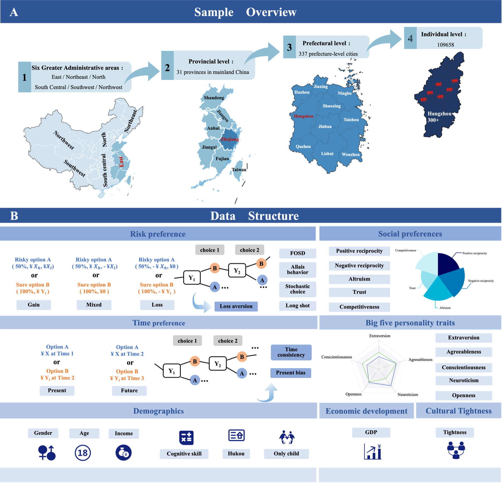

[🏠 首页](index.md) | [🔬 科研项目](projects.md) | [📚 论文发表](papers.md) | [🏆 获奖荣誉](awards.md) | [🏫 暑期学校](summer-school.md) | [🌐 平台资源](platforms.md) | [🛠️ 实验设备](equipment.md) | [💻 GitHub](https://github.com/decisionneuroscience)

# Platform Resources | 平台资源

汇集本团队自主开发或建设的研究工具、数据平台与开放资源，为行为决策、计算建模和跨学科研究提供可复用的研究基础设施。

<section class="resource-card">
  
01 · Research Project

  <h2>GeoGaze</h2>
  
基于计算机视觉的眼动技术解决方案。

</section>

<section class="resource-card">
  
02 · Survey & Data Platform

  <h2>China Preference and Personality Survey · 中国偏好与人格调查</h2>
  
<strong>China Preference and Personality Survey（CPPS）</strong> 是面向中国人群偏好、人格与社会经济特征研究的综合调查平台。项目覆盖中国大陆 31 个省、337 个地级市和 109,658 名受访者，形成从宏观区域到个体层面的多层级研究资料。

  
<strong>对应工作论文：</strong>Shen Q., Xiao Q., Zhong S. <em>Preferences and Personality Traits in China: Evidence from a Large-Scale Nationwide Survey</em>. Working paper.

  

    
<strong>偏好测量</strong>风险、时间与社会偏好

    
<strong>人格特征</strong>大五人格与相关心理指标

    
<strong>多层级信息</strong>人口学、经济发展与文化紧密度

  

  

    <a href="https://cpps2025.github.io/" target="_blank" rel="noopener noreferrer">访问 CPPS 平台 ↗</a>
  

  <figure class="resource-figure">
    
    <figcaption><strong>项目概览。</strong> CPPS 的全国样本覆盖与数据结构，包括风险偏好、时间偏好、社会偏好、大五人格、人口学特征及区域层面指标。点击图片访问项目平台。</figcaption>
  </figure>
</section>

---
[← 返回首页](index.md)
